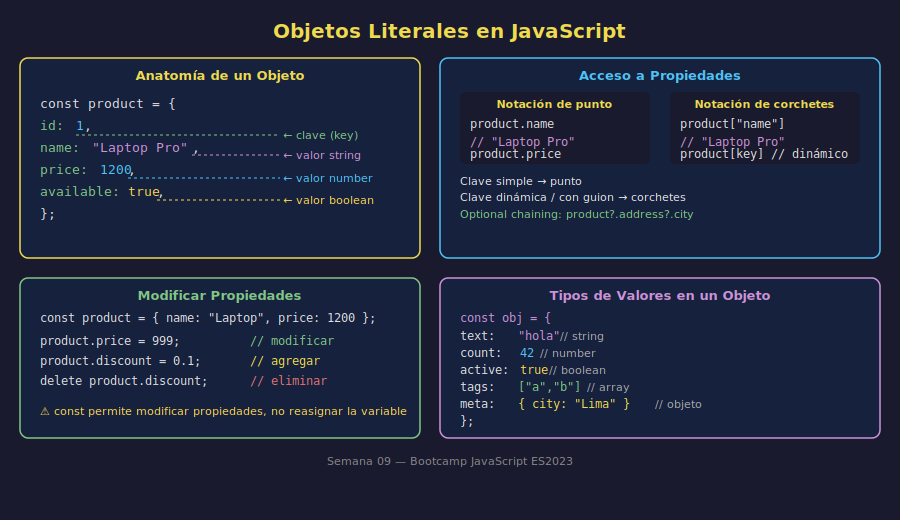

# 01 — Objetos Literales: Crear y Acceder

## 🎯 Objetivos

- Entender qué es un objeto y cuándo usarlo en lugar de variables separadas
- Crear objetos con la sintaxis literal `{}`
- Acceder y modificar propiedades con notación de punto y de corchetes
- Agregar y eliminar propiedades dinámicamente

---

## 1. ¿Qué es un Objeto?

Un objeto agrupa datos relacionados bajo un mismo nombre. En lugar de tener variables sueltas:

```javascript
// ❌ Variables sueltas — difícil de manejar
const userName = "Ana";
const userAge = 28;
const userActive = true;

// ✅ Objeto — todo junto, relacionado
const user = {
  name: "Ana",
  age: 28,
  active: true,
};
```

Un objeto es una colección de **pares clave-valor** (key-value pairs). Cada clave es una cadena de texto (la propiedad) y cada valor puede ser cualquier tipo de dato.



---

## 2. Crear Objetos Literales

Se usan llaves `{}` para definir un objeto. Las propiedades se separan con comas:

```javascript
const product = {
  id: 1,
  name: "Laptop Pro",
  price: 1200,
  available: true,
  category: "electronics",
};
```

### Valores válidos

```javascript
const example = {
  text: "Hola", // string
  quantity: 42, // number
  active: true, // boolean
  data: null, // null
  tags: ["a", "b", "c"], // array
  address: {
    // objeto anidado
    city: "Madrid",
    country: "España",
  },
};
```

---

## 3. Acceso con Notación de Punto (`.`)

Es la forma más común. Se usa cuando la clave es un identificador válido:

```javascript
const product = {
  id: 1,
  name: "Laptop Pro",
  price: 1200,
};

console.log(product.name); // "Laptop Pro"
console.log(product.price); // 1200
console.log(product.id); // 1
```

Para propiedades anidadas, se encadena el punto:

```javascript
const user = {
  name: "Ana",
  address: {
    city: "Lima",
    country: "Perú",
  },
};

console.log(user.address.city); // "Lima"
```

---

## 4. Acceso con Notación de Corchetes (`[]`)

Se usa cuando la clave es dinámica (viene de una variable) o contiene caracteres especiales:

```javascript
const product = {
  id: 1,
  name: "Laptop Pro",
  "display-size": 15.6, // clave con guion: requiere corchetes
};

// Acceso con string literal
console.log(product["name"]); // "Laptop Pro"
console.log(product["display-size"]); // 15.6

// Acceso con variable dinámica
const key = "name";
console.log(product[key]); // "Laptop Pro"

// Recorrer propiedades dinámicamente
const fields = ["id", "name", "price"];
fields.forEach((field) => {
  console.log(`${field}: ${product[field]}`);
});
```

### ¿Cuándo usar punto vs corchetes?

| Situación                      | Usar                     |
| ------------------------------ | ------------------------ |
| Clave es un nombre simple      | `.` (punto)              |
| Clave viene de una variable    | `[]` (corchetes)         |
| Clave tiene espacios o guiones | `[]` (corchetes)         |
| La propiedad puede no existir  | `?.` (optional chaining) |

---

## 5. Modificar Propiedades

Los objetos definidos con `const` no son inmutables: sus propiedades se pueden cambiar. `const` solo impide reasignar la variable, no modificar el contenido.

```javascript
const product = {
  name: "Laptop Pro",
  price: 1200,
};

// Modificar propiedad existente
product.price = 999;
console.log(product.price); // 999

// Agregar propiedad nueva
product.discount = 0.1;
console.log(product); // { name: "Laptop Pro", price: 999, discount: 0.1 }

// Eliminar propiedad
delete product.discount;
console.log(product); // { name: "Laptop Pro", price: 999 }
```

### `const` con objetos

```javascript
const user = { name: "Ana" };

user.name = "Luis"; // ✅ Permitido — modificar propiedad
user.age = 30; // ✅ Permitido — agregar propiedad

// user = { name: "otro" }; // ❌ Error — no se puede reasignar la variable
```

---

## 6. Acceso Seguro con Optional Chaining (`?.`)

Si la propiedad puede no existir (puede ser `undefined`), usa `?.` para evitar errores:

```javascript
const user = {
  name: "Carlos",
  // address no existe
};

// Sin optional chaining → Error: Cannot read properties of undefined
// console.log(user.address.city);

// Con optional chaining → devuelve undefined sin error
console.log(user?.address?.city); // undefined
```

---

## ✅ Checklist de Verificación

- [ ] Sé crear un objeto literal con múltiples propiedades y tipos de valores
- [ ] Accedo a propiedades con notación de punto cuando la clave es simple
- [ ] Uso corchetes cuando la clave es dinámica o tiene caracteres especiales
- [ ] Sé modificar, agregar y eliminar propiedades de un objeto
- [ ] Comprendo por qué `const` no impide modificar las propiedades de un objeto
- [ ] Uso `?.` para acceso seguro cuando la propiedad puede no existir
