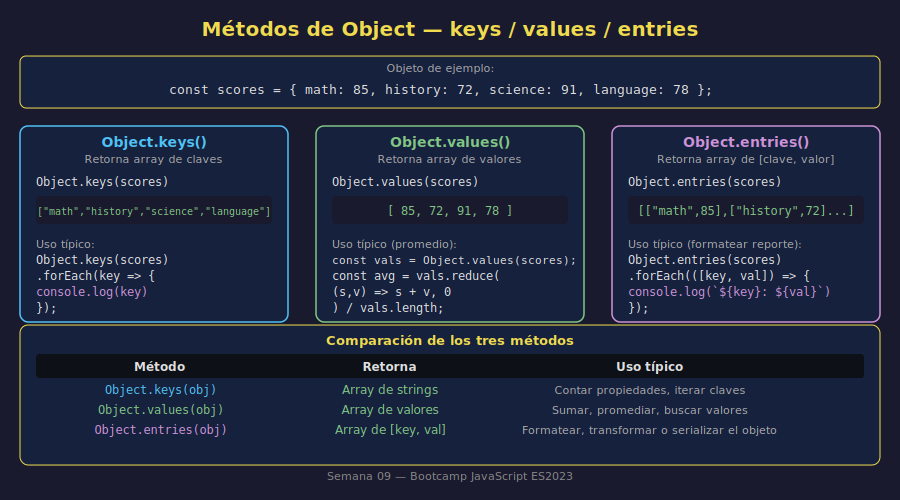

# 02 — Métodos de Objeto y `Object.*`

## 🎯 Objetivos

- Agregar métodos a un objeto (funciones como valores)
- Usar `Object.keys()`, `Object.values()` y `Object.entries()` para inspeccionar objetos
- Transformar las entradas de un objeto en strings formateados

---

## 1. Métodos de Objeto

Un **método** es una función almacenada como propiedad de un objeto:

```javascript
const calculator = {
  brand: "CalcPro",
  add: (a, b) => a + b,
  subtract: (a, b) => a - b,
  multiply: (a, b) => a * b,
};

console.log(calculator.add(5, 3)); // 8
console.log(calculator.multiply(4, 7)); // 28
console.log(calculator.brand); // "CalcPro"
```

Los métodos se invocan igual que una función, pero precedidos del nombre del objeto y un punto.

### Métodos con lógica interna

```javascript
const greetingSystem = {
  prefix: "Bienvenido",
  greet: (name) => `${greetingSystem.prefix}, ${name}!`,
  greetFormal: (name, title) => `${greetingSystem.prefix}, ${title} ${name}.`,
};

console.log(greetingSystem.greet("Ana")); // "Bienvenido, Ana!"
console.log(greetingSystem.greetFormal("García", "Dr.")); // "Bienvenido, Dr. García."
```

---

## 2. `Object.keys()` — Obtener las Claves

Retorna un array con todas las **claves** (nombres de propiedades) del objeto:

```javascript
const product = {
  id: 1,
  name: "Laptop Pro",
  price: 1200,
  available: true,
};

const keys = Object.keys(product);
console.log(keys); // ["id", "name", "price", "available"]
console.log(keys.length); // 4 — número de propiedades
```

Es muy útil para contar propiedades o procesarlas dinámicamente:

```javascript
// Mostrar cada clave
Object.keys(product).forEach((key) => {
  console.log(key);
});
```

---

## 3. `Object.values()` — Obtener los Valores

Retorna un array con todos los **valores** del objeto:

```javascript
const scores = {
  math: 85,
  history: 72,
  science: 91,
  language: 78,
};

const values = Object.values(scores);
console.log(values); // [85, 72, 91, 78]

// Calcular promedio usando los valores
const average = values.reduce((sum, v) => sum + v, 0) / values.length;
console.log(`Promedio: ${average.toFixed(1)}`); // "Promedio: 81.5"
```

---

## 4. `Object.entries()` — Obtener Pares Clave-Valor

Retorna un array de arrays `[clave, valor]`. Muy potente para transformar objetos:

```javascript
const product = {
  id: 1,
  name: "Laptop Pro",
  price: 1200,
};

const entries = Object.entries(product);
console.log(entries);
// [["id", 1], ["name", "Laptop Pro"], ["price", 1200]]

// Iterar mostrando cada par clave-valor
Object.entries(product).forEach(([key, value]) => {
  console.log(`  ${key}: ${value}`);
});
// id: 1
// name: Laptop Pro
// price: 1200
```

### Comparación: `keys()` vs `values()` vs `entries()`

```javascript
const obj = { a: 1, b: 2, c: 3 };

Object.keys(obj); // ["a", "b", "c"]    — solo claves
Object.values(obj); // [1, 2, 3]          — solo valores
Object.entries(obj); // [["a",1],["b",2],["c",3]] — todo
```

| Método                | Retorna               | Uso típico                                            |
| --------------------- | --------------------- | ----------------------------------------------------- |
| `Object.keys(obj)`    | Array de strings      | Verificar qué propiedades existen, contar propiedades |
| `Object.values(obj)`  | Array de valores      | Sumar, promediar, buscar en valores                   |
| `Object.entries(obj)` | Array de `[key, val]` | Transformar o formatear el objeto completo            |



---

## 5. Formatear Objetos con `entries()`

`Object.entries()` combinado con `map` es ideal para generar reportes:

```javascript
const config = {
  host: "localhost",
  port: 3000,
  debug: true,
  version: "1.0.0",
};

// Generar líneas de reporte
const lines = Object.entries(config).map(
  ([key, value]) => `  ${key.padEnd(10)}: ${value}`,
);

console.log("Configuración:");
lines.forEach((line) => console.log(line));
// Configuración:
//   host      : localhost
//   port      : 3000
//   debug     : true
//   version   : 1.0.0
```

---

## ✅ Checklist de Verificación

- [ ] Agrego métodos a un objeto usando arrow functions
- [ ] Uso `Object.keys()` para obtener las claves de un objeto
- [ ] Uso `Object.values()` para obtener los valores y operarlos
- [ ] Uso `Object.entries()` con desestructuración `([key, value])` para iterar
- [ ] Combino `Object.entries()` con `map` para generar reportes formateados
