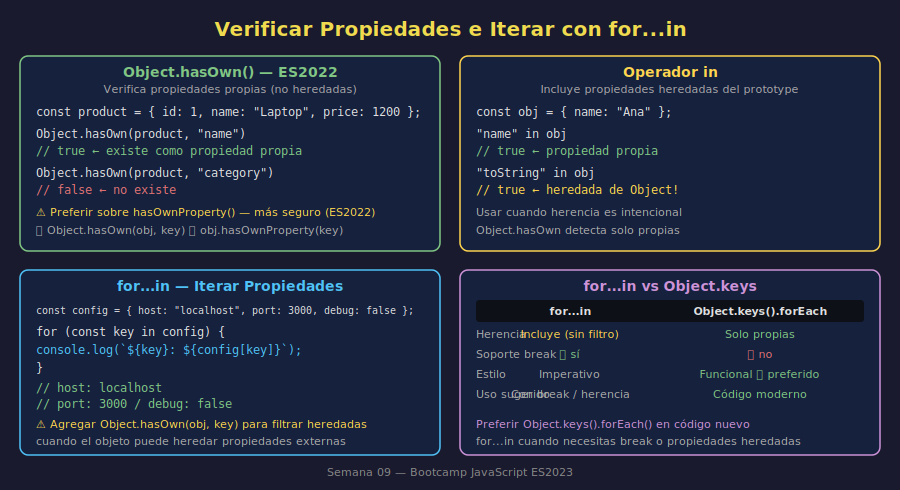

# 03 — Verificar Propiedades e Iterar con `for...in`

## 🎯 Objetivos

- Verificar si un objeto tiene una propiedad con `Object.hasOwn()` (ES2022)
- Entender la diferencia entre `Object.hasOwn()` y el operador `in`
- Recorrer las propiedades de un objeto con `for...in`
- Distinguir propiedades propias de propiedades heredadas

---

## 1. `Object.hasOwn()` — Verificar Propiedades (ES2022)

`Object.hasOwn(obj, key)` retorna `true` si el objeto tiene la propiedad indicada como **propia** (no heredada):

```javascript
const product = {
  id: 1,
  name: "Laptop Pro",
  price: 1200,
};

console.log(Object.hasOwn(product, "name")); // true
console.log(Object.hasOwn(product, "price")); // true
console.log(Object.hasOwn(product, "category")); // false — no existe
```

### ¿Por qué `Object.hasOwn()` y no `hasOwnProperty`?

`Object.hasOwn()` es la forma moderna (ES2022). Es más segura porque:

```javascript
// ✅ Moderno y seguro (ES2022)
Object.hasOwn(product, "name"); // true

// ❌ Antiguo — puede fallar si el objeto tiene su propio hasOwnProperty
product.hasOwnProperty("name"); // puede fallar en casos extremos
```

> **Regla**: En este bootcamp, siempre usar `Object.hasOwn()`.

---

## 2. El Operador `in`

El operador `in` verifica si una propiedad existe en el objeto **o en su cadena de prototipos** (propiedades heredadas incluidas):

```javascript
const product = {
  id: 1,
  name: "Laptop Pro",
};

console.log("name" in product); // true  — propiedad propia
console.log("id" in product); // true  — propiedad propia
console.log("toString" in product); // true  — heredada de Object!
```

### Comparación: `Object.hasOwn()` vs `in`

```javascript
const obj = { name: "Ana" };

Object.hasOwn(obj, "name"); // true  — propiedad propia
Object.hasOwn(obj, "toString"); // false — heredada, no propia

"name" in obj; // true  — propia
"toString" in obj; // true  — heredada también cuenta
```

|                       | `Object.hasOwn()`                                | `in`                                         |
| --------------------- | ------------------------------------------------ | -------------------------------------------- |
| Propiedades propias   | ✅ detecta                                       | ✅ detecta                                   |
| Propiedades heredadas | ❌ no detecta                                    | ✅ detecta                                   |
| Uso recomendado       | Verificar si el objeto tiene su propia propiedad | Verificar existencia incluyendo el prototype |

---

## 3. `for...in` — Iterar Propiedades

`for...in` recorre las claves enumerables de un objeto (las propiedades que se definieron en el literal):

```javascript
const config = {
  host: "localhost",
  port: 3000,
  debug: false,
};

for (const key in config) {
  console.log(`${key}: ${config[key]}`);
}
// host: localhost
// port: 3000
// debug: false
```



### Filtrar propiedades propias en `for...in`

Por seguridad, es buena práctica filtrar propiedades propias dentro de `for...in`:

```javascript
const base = { shared: "valor compartido" };
const derived = Object.create(base);
derived.own = "propiedad propia";

// Sin filtro — incluye propiedades heredadas
for (const key in derived) {
  console.log(key); // "own", "shared"
}

// Con filtro — solo propiedades propias
for (const key in derived) {
  if (Object.hasOwn(derived, key)) {
    console.log(key); // "own"
  }
}
```

### `for...in` vs `Object.keys()` + `forEach`

Ambas formas recorren las propiedades de un objeto. La diferencia principal:

```javascript
const user = { name: "Ana", age: 28 };

// for...in
for (const key in user) {
  console.log(`${key}: ${user[key]}`);
}

// Object.keys + forEach (preferida en código funcional)
Object.keys(user).forEach((key) => {
  console.log(`${key}: ${user[key]}`);
});
```

|                   | `for...in`                                      | `Object.keys().forEach()`       |
| ----------------- | ----------------------------------------------- | ------------------------------- |
| Incluye heredadas | ✅ (sin filtro)                                 | ❌ solo propias                 |
| Soporte `break`   | ✅                                              | ❌ (usar `for...of` sobre keys) |
| Estilo funcional  | ❌                                              | ✅                              |
| Uso recomendado   | Cuando necesitas `break` o herencia intencional | Código funcional y moderno      |

---

## 4. Acceso Seguro a Propiedades Opcionales

Combina `Object.hasOwn()` con acceso condicional para manejo robusto:

```javascript
const printDiscount = (product) => {
  if (Object.hasOwn(product, "discount")) {
    console.log(`Descuento: ${product.discount * 100}%`);
  } else {
    console.log("Sin descuento");
  }
};

printDiscount({ name: "Laptop", price: 1200, discount: 0.15 }); // "Descuento: 15%"
printDiscount({ name: "Mouse", price: 25 }); // "Sin descuento"
```

---

## ✅ Checklist de Verificación

- [ ] Uso `Object.hasOwn()` para verificar propiedades propias (no `hasOwnProperty`)
- [ ] Entiendo la diferencia entre `Object.hasOwn()` y el operador `in`
- [ ] Recorro objetos con `for...in` y sé filtrar propiedades propias
- [ ] Prefiero `Object.keys().forEach()` sobre `for...in` cuando no necesito heredadas ni `break`
