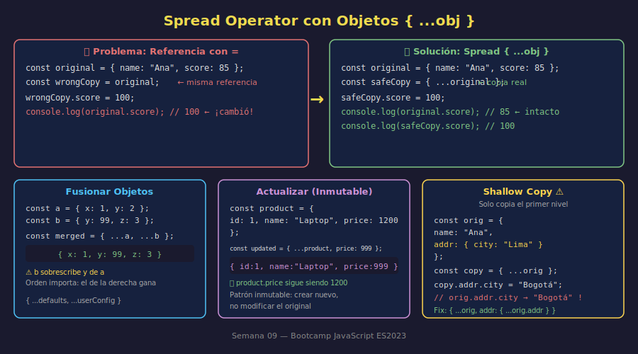

# 04 — Spread con Objetos

## 🎯 Objetivos

- Entender el problema de referencia en objetos (igual que en arrays)
- Copiar objetos con spread `{ ...obj }`
- Fusionar objetos y sobrescribir propiedades específicas
- Entender las limitaciones de la copia superficial (shallow copy)

---

## 1. El Problema de Referencia en Objetos

Al igual que con arrays, asignar un objeto con `=` no crea una copia sino una **referencia** al mismo espacio en memoria:

```javascript
const original = { name: "Ana", score: 85 };
const wrongCopy = original; // ← misma referencia

wrongCopy.score = 100;
console.log(original.score); // 100 ← ¡el original cambió!
```

**La solución**: usar spread para crear una copia en el primer nivel:

```javascript
const original = { name: "Ana", score: 85 };
const safeCopy = { ...original }; // ✅ nueva referencia

safeCopy.score = 100;
console.log(original.score); // 85 ← intacto
console.log(safeCopy.score); // 100
```



---

## 2. Copiar un Objeto

```javascript
const config = {
  host: "localhost",
  port: 3000,
  debug: false,
};

// Crear copia
const devConfig = { ...config };

// Modificar la copia sin afectar el original
devConfig.debug = true;
devConfig.port = 4000;

console.log(config); // { host: "localhost", port: 3000, debug: false }
console.log(devConfig); // { host: "localhost", port: 4000, debug: true }
```

---

## 3. Fusionar Objetos

Spread fusiona las propiedades de múltiples objetos en uno nuevo:

```javascript
const defaults = {
  theme: "dark",
  language: "es",
  notifications: true,
};

const userPreferences = {
  theme: "light",
  fontSize: 16,
};

// Fusionar: las propiedades del segundo sobrescriben al primero
const finalConfig = { ...defaults, ...userPreferences };

console.log(finalConfig);
// {
//   theme: "light",      ← sobrescrito por userPreferences
//   language: "es",      ← solo en defaults
//   notifications: true, ← solo en defaults
//   fontSize: 16,        ← solo en userPreferences
// }
```

> **Orden importa**: las propiedades de la derecha sobrescriben las de la izquierda.

---

## 4. Actualizar Propiedades Específicas (Patrón Inmutable)

En lugar de mutar el objeto original, crea uno nuevo con la propiedad actualizada:

```javascript
const product = {
  id: 1,
  name: "Laptop Pro",
  price: 1200,
  available: true,
};

// Patrón inmutable: crear nuevo objeto con precio actualizado
const updatedProduct = { ...product, price: 999 };

console.log(product.price); // 1200 ← original intacto
console.log(updatedProduct.price); // 999  ← nuevo objeto
```

Este patrón es muy común en aplicaciones modernas (React, gestores de estado):

```javascript
// Actualizar estado sin mutarlo
const currentState = { user: "Ana", count: 0, loading: false };
const newState = { ...currentState, count: currentState.count + 1 };
```

---

## 5. Agregar Propiedades Nuevas al Copiar

```javascript
const base = {
  id: 1,
  name: "Producto Base",
};

// Copiar y agregar propiedades nuevas
const extended = {
  ...base,
  price: 50,
  category: "general",
  createdAt: "2025-01-01",
};

console.log(extended);
// { id: 1, name: "Producto Base", price: 50, category: "general", createdAt: "2025-01-01" }
```

---

## 6. Limitación: Shallow Copy (Copia Superficial)

Spread solo copia **el primer nivel**. Si el objeto tiene propiedades que son objetos anidados, esas siguen siendo referencias:

```javascript
const original = {
  name: "Ana",
  address: { city: "Lima", country: "Perú" }, // objeto anidado
};

const copy = { ...original };

copy.name = "Luis"; // ✅ No afecta el original
copy.address.city = "Bogotá"; // ❌ Sí afecta el original

console.log(original.name); // "Ana"    ← intacto
console.log(original.address.city); // "Bogotá" ← ¡cambió!
```

**Para objetos anidados**, hay que hacer spread en cada nivel:

```javascript
const deepCopy = {
  ...original,
  address: { ...original.address }, // copia el objeto anidado también
};

deepCopy.address.city = "Buenos Aires";
console.log(original.address.city); // "Bogotá" ← ahora sí intacto
```

---

## ✅ Checklist de Verificación

- [ ] Entiendo que `= ` en objetos crea referencia, no copia
- [ ] Uso `{ ...obj }` para crear una copia superficial
- [ ] Fusiono objetos con `{ ...obj1, ...obj2 }` sabiendo que el segundo sobrescribe
- [ ] Aplico el patrón inmutable: `{ ...original, property: newValue }` para "actualizar"
- [ ] Sé que spread es shallow copy y cómo manejar objetos anidados
