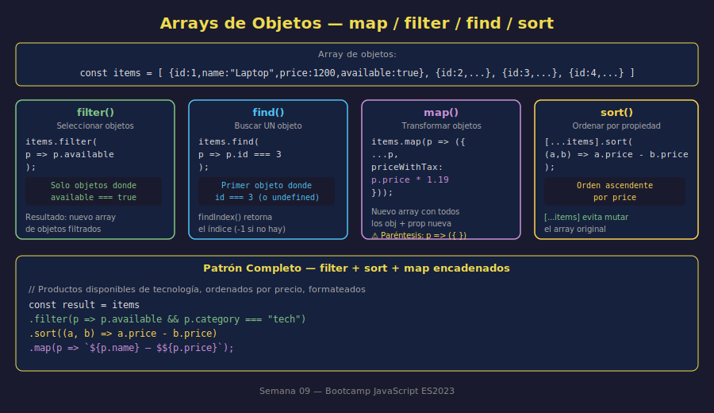

# 05 — Arrays de Objetos

## 🎯 Objetivos

- Crear y recorrer arrays de objetos
- Usar `map`, `filter`, `find` y `findIndex` con objetos
- Ordenar arrays de objetos con `sort`
- Aplicar el patrón de actualización inmutable en arrays de objetos

---

## 1. Arrays de Objetos

La combinación más poderosa y común en JavaScript: un array donde cada elemento es un objeto. Representa colecciones de entidades del mundo real.

```javascript
const products = [
  { id: 1, name: "Laptop Pro", price: 1200, available: true },
  { id: 2, name: "Mouse Inalámbrico", price: 35, available: true },
  { id: 3, name: "Monitor 4K", price: 450, available: false },
  { id: 4, name: "Teclado Mecánico", price: 120, available: true },
];
```

Acceso a un objeto y sus propiedades:

```javascript
console.log(products[0]); // { id: 1, name: "Laptop Pro", ... }
console.log(products[0].name); // "Laptop Pro"
console.log(products[2].available); // false
```



---

## 2. `forEach` — Recorrer Todos los Elementos

```javascript
const products = [
  { id: 1, name: "Laptop Pro", price: 1200, available: true },
  { id: 2, name: "Mouse", price: 35, available: true },
  { id: 3, name: "Monitor 4K", price: 450, available: false },
];

products.forEach((product) => {
  const status = product.available ? "✅" : "❌";
  console.log(`${status} [${product.id}] ${product.name} — $${product.price}`);
});
// ✅ [1] Laptop Pro — $1200
// ✅ [2] Mouse — $35
// ❌ [3] Monitor 4K — $450
```

---

## 3. `filter` — Seleccionar Objetos por Condición

```javascript
const products = [
  { id: 1, name: "Laptop Pro", price: 1200, available: true },
  { id: 2, name: "Mouse", price: 35, available: true },
  { id: 3, name: "Monitor 4K", price: 450, available: false },
  { id: 4, name: "Teclado", price: 120, available: true },
];

// Filtrar solo disponibles
const available = products.filter((p) => p.available);
console.log(available.map((p) => p.name)); // ["Laptop Pro", "Mouse", "Teclado"]

// Filtrar por precio
const affordable = products.filter((p) => p.price < 200);
console.log(affordable.map((p) => p.name)); // ["Mouse", "Teclado"]
```

---

## 4. `find` y `findIndex` — Buscar un Objeto

`find` retorna el **primer objeto** que cumple la condición. `findIndex` retorna su **índice**:

```javascript
const users = [
  { id: 1, name: "Ana", active: true },
  { id: 2, name: "Luis", active: false },
  { id: 3, name: "María", active: true },
];

// Buscar por id
const found = users.find((u) => u.id === 2);
console.log(found); // { id: 2, name: "Luis", active: false }

// Buscar índice para actualizar
const idx = users.findIndex((u) => u.id === 2);
console.log(idx); // 1

// Actualizar inmutablemente (sin mutar el array original)
const updatedUsers = users.map((u) =>
  u.id === 2 ? { ...u, active: true } : u,
);
console.log(updatedUsers[1].active); // true
console.log(users[1].active); // false ← original intacto
```

---

## 5. `map` — Transformar Objetos

`map` sobre un array de objetos permite crear un nuevo array con objetos transformados:

```javascript
const products = [
  { id: 1, name: "Laptop Pro", price: 1200 },
  { id: 2, name: "Mouse", price: 35 },
  { id: 3, name: "Monitor 4K", price: 450 },
];

// Agregar propiedad calculada a cada objeto
const withTax = products.map((p) => ({
  ...p,
  priceWithTax: +(p.price * 1.19).toFixed(2),
}));

console.log(withTax[0]);
// { id: 1, name: "Laptop Pro", price: 1200, priceWithTax: 1428 }

// Extraer solo algunos campos (proyección)
const summary = products.map((p) => ({ id: p.id, name: p.name }));
console.log(summary);
// [{ id: 1, name: "Laptop Pro" }, { id: 2, name: "Mouse" }, ...]
```

> **Nota**: `({ ...p, newProp: value })` — los paréntesis son necesarios cuando el cuerpo de la arrow function es un objeto literal (para distinguirlo de las llaves del bloque de función).

---

## 6. `sort` — Ordenar por Propiedad

`sort` con un comparador permite ordenar arrays de objetos:

```javascript
const products = [
  { id: 1, name: "Laptop Pro", price: 1200 },
  { id: 2, name: "Mouse", price: 35 },
  { id: 3, name: "Teclado", price: 120 },
  { id: 4, name: "Monitor 4K", price: 450 },
];

// Ordenar por precio (ascendente)
const byPriceAsc = [...products].sort((a, b) => a.price - b.price);
console.log(byPriceAsc.map((p) => `${p.name}: $${p.price}`));
// ["Mouse: $35", "Teclado: $120", "Monitor 4K: $450", "Laptop Pro: $1200"]

// Ordenar por nombre (alfabético)
const byName = [...products].sort((a, b) => a.name.localeCompare(b.name));
console.log(byName.map((p) => p.name));
// ["Laptop Pro", "Monitor 4K", "Mouse", "Teclado"]
```

> **Importante**: `[...products].sort(...)` — hacer spread antes de `sort` para no mutar el array original (porque `sort` muta in-place).

---

## 7. Patrón Completo: Procesar un Catálogo

```javascript
const catalog = [
  { id: 1, name: "Laptop Pro", price: 1200, available: true, category: "tech" },
  { id: 2, name: "Mouse", price: 35, available: true, category: "tech" },
  {
    id: 3,
    name: "Silla Ergonómica",
    price: 300,
    available: false,
    category: "furniture",
  },
  { id: 4, name: "Teclado", price: 120, available: true, category: "tech" },
  {
    id: 5,
    name: "Escritorio",
    price: 450,
    available: true,
    category: "furniture",
  },
];

// Disponibles de tecnología, ordenados por precio
const techAvailable = catalog
  .filter((item) => item.category === "tech" && item.available)
  .sort((a, b) => a.price - b.price)
  .map((item) => `${item.name} ($${item.price})`);

console.log("Tech disponible (por precio):", techAvailable);
// ["Mouse ($35)", "Teclado ($120)", "Laptop Pro ($1200)"]
```

---

## ✅ Checklist de Verificación

- [ ] Creo arrays de objetos con múltiples propiedades
- [ ] Accedo a propiedades de objetos dentro de un array (`arr[i].prop`)
- [ ] Uso `filter` para seleccionar objetos por condición
- [ ] Uso `find`/`findIndex` para localizar un objeto específico
- [ ] Uso `map` para transformar objetos (agregar propiedades, proyectar campos)
- [ ] Uso `[...arr].sort()` para ordenar sin mutar el original
- [ ] Encadeno `filter + sort + map` para procesar catálogos
